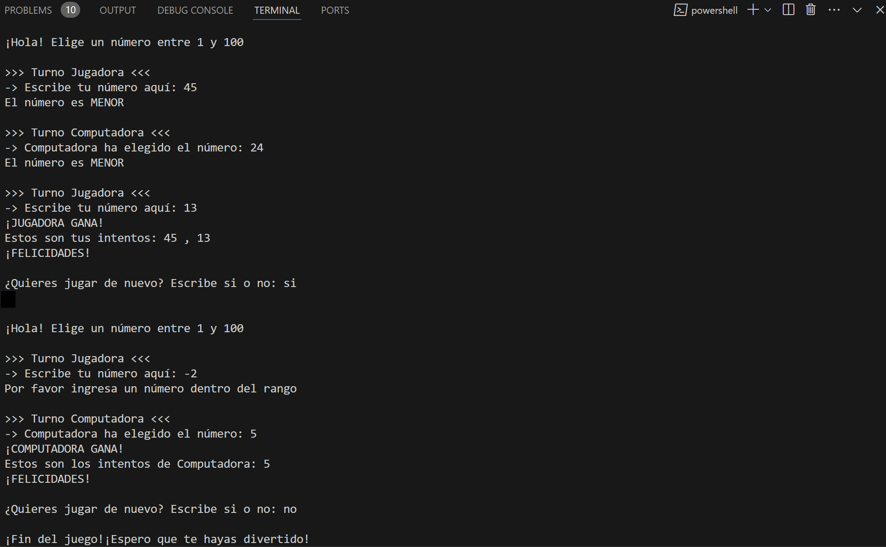

# GUESS-THE-NUMBER
 
## Introducción

Guess the Number es un juego interactivo creado 100% en Python que se ejecuta en la terminal. Permite a un usuario competir con la computadora. El rango para elegir un número es de 1 al 100 y cada vez que uno de los jugadores realiza un intento se muestra si la suposición debería ser mayor o menor.

## Funcionalidades

Se debe tener en cuenta que este juego se ejecuta en la terminal. Ya en la terminal se muestra lo siguiente:

1. Un input que permite ingresar la suposición al usuario

2. Si la suposición es incorrecta se muestra la siguiente línea que permite saber si debe elegir un número más alto o menor.

3. Ahora le toca el turno de la computadora, si el número elegido por la computadora es incorrecto entonces se muestra directirces para saber si el número debe ser mayor o menor.

4. El juego continúa hasta que uno de los contrincantes adivina.

5. Cuando se da con el número correcto se muestra al usuario la opción de jugar de nuevo, si fuera así el ciclo se repite.

6. Si el usuario decide que no quiere seguir jugando entonces el ciclo se termina y se muestra un mensaje de despedida.

Ejemplo de Guess-The-Number ejecutado en la terminal.

Guess the Number incluye pruebas unitarias que han sido desarrolladas usando la librería incorporada en Python llamada unittest.

